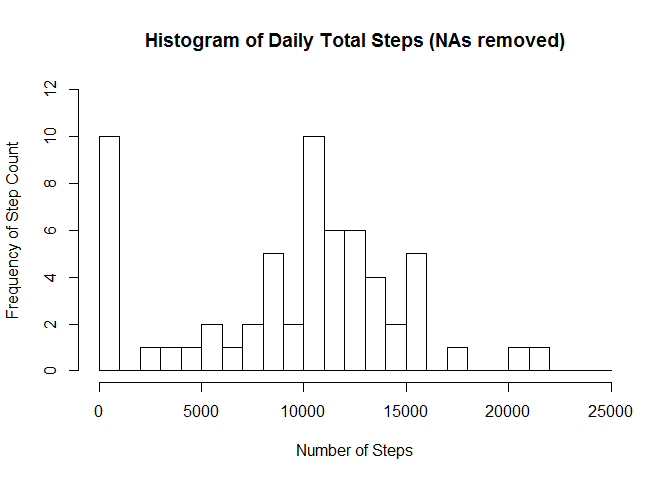
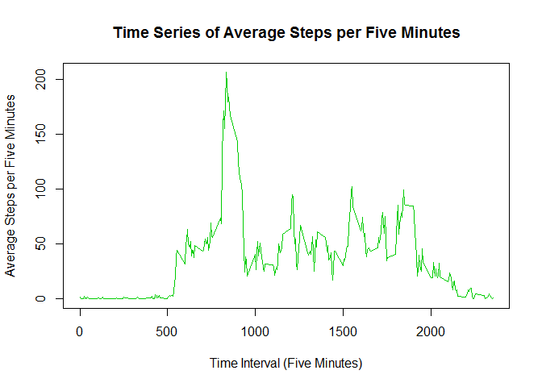
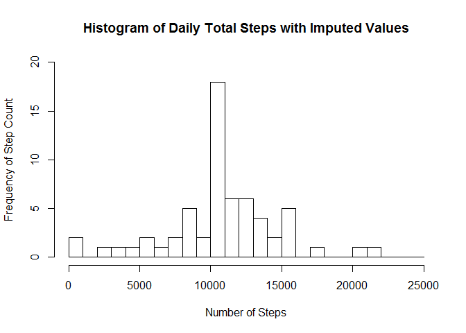
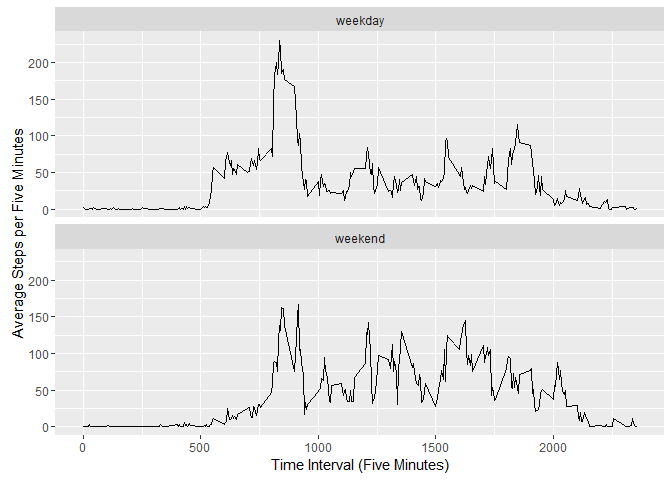

# Reproducible Research: Peer Assessment 1
## Jill A Brown

## Loading and preprocessing the data
Loading Libraries

```r
library(dplyr)
library(knitr)
library(ggplot2)
```

Read in Data

```r
activitydata <- read.csv("../activity.csv")
```


## What is the mean total number of steps taken per day?
These values were calculated after removal of missing data.

```r
#create activity by day dataset
activitydata.day <- aggregate(activitydata$steps, by=list(Category=activitydata$date), 
                              na.rm=TRUE, FUN=sum)

#histogram by day
hist(activitydata.day$x, xlab="Number of Steps", ylab="Frequency of Step Count",
     main="Histogram of Daily Total Steps (NAs removed)", 
     breaks=seq(from=0, to=25000, by=1000), ylim=c(0,12))
```

<!-- -->

```r
#mean steps per day (NAs removed)
mean(activitydata.day$x)
```

```
## [1] 9354.23
```

```r
#median steps per day (NAs removed)
median(activitydata.day$x)
```

```
## [1] 10395
```


## What is the average daily activity pattern?

```r
#create activity by time interval dataset
activitydata.time <- aggregate(activitydata$steps,
                               by=list(Category=activitydata$interval),
                               na.rm=TRUE, FUN=mean)

#plot by time period
plot(activitydata.time$Category, activitydata.time$x, type = "l", col = 3,
     xlab="Time Interval (Five Minutes)", ylab="Average Steps per Five Minutes", 
     main="Time Series of Average Steps per Five Minutes")
```

<!-- -->

```r
#time period with highest average steps
timeinterval.int <- activitydata.time[which.max(activitydata.time$x),1]
timeinterval.mean <- activitydata.time[which.max(activitydata.time$x),2]
```

The interval with the highest average steps is 835 with an average of 206.1698113 steps.


## Imputing missing values
I decided to impute by replacing missing values with the average value for that interval.

```r
#missing values
sum(is.na(activitydata$steps))
```

```
## [1] 2304
```

```r
activitydata.imputed <- transform(activitydata, steps = ifelse(is.na(activitydata$steps),
                                      activitydata.time$x[match(activitydata$interval,
                                      activitydata.time$Category)], activitydata$steps))

#histogram by day imputed
activitydata.dayimpute <- aggregate(activitydata.imputed$steps,
                                    by=list(Category=activitydata.imputed$date),
                                    na.rm=TRUE, FUN=sum)

hist(activitydata.dayimpute$x, xlab="Number of Steps", ylab="Frequency of Step Count",
     main="Histogram of Daily Total Steps with Imputed Values", 
     breaks=seq(from=0, to=25000, by=1000), ylim=c(0,20))
```

<!-- -->

```r
#mean imputed
mean(activitydata.dayimpute$x)
```

```
## [1] 10766.19
```

```r
#median imputed
median(activitydata.dayimpute$x)
```

```
## [1] 10766.19
```
Both the mean and median increased from the dataset with missing data.


## Are there differences in activity patterns between weekdays and weekends?

```r
activitydata.imputed$date2 <- strptime(activitydata.imputed$date, format = "%Y-%m-%d")

activitydata.imputed$daytype <- weekdays(activitydata.imputed$date2)
activitydata.imputed$weekend <- ifelse(activitydata.imputed$daytype == "Saturday" | 
                                         activitydata.imputed$daytype == "Sunday", 
                                       "weekend", "weekday")

activitydata.wkend <- aggregate(activitydata.imputed$steps, 
                                by=list(activitydata.imputed$weekend, 
                                        activitydata.imputed$interval), FUN=mean)

ggplot(activitydata.wkend, aes(x=Group.2, y=x)) +
    geom_line() +
    facet_wrap(~ Group.1, nrow=2, ncol=1) +
    labs(x="Time Interval (Five Minutes)", y="Average Steps per Five Minutes")
```

<!-- -->

During the weekdays and weekends the peaks in activity levels are in the morning.  However, there is more consistent activity over the weekends (a greater number of peaks).
